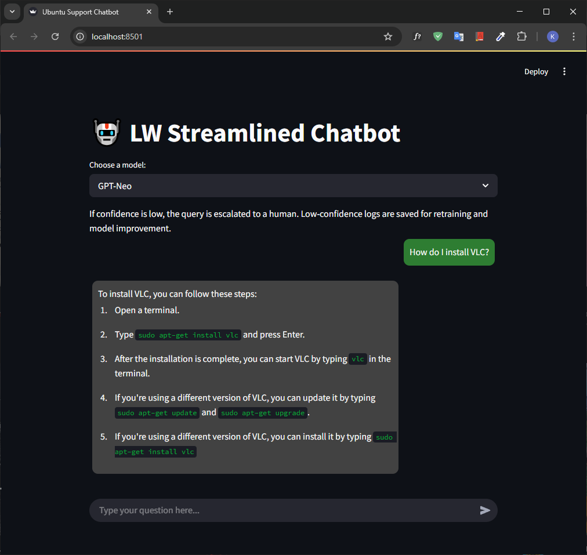
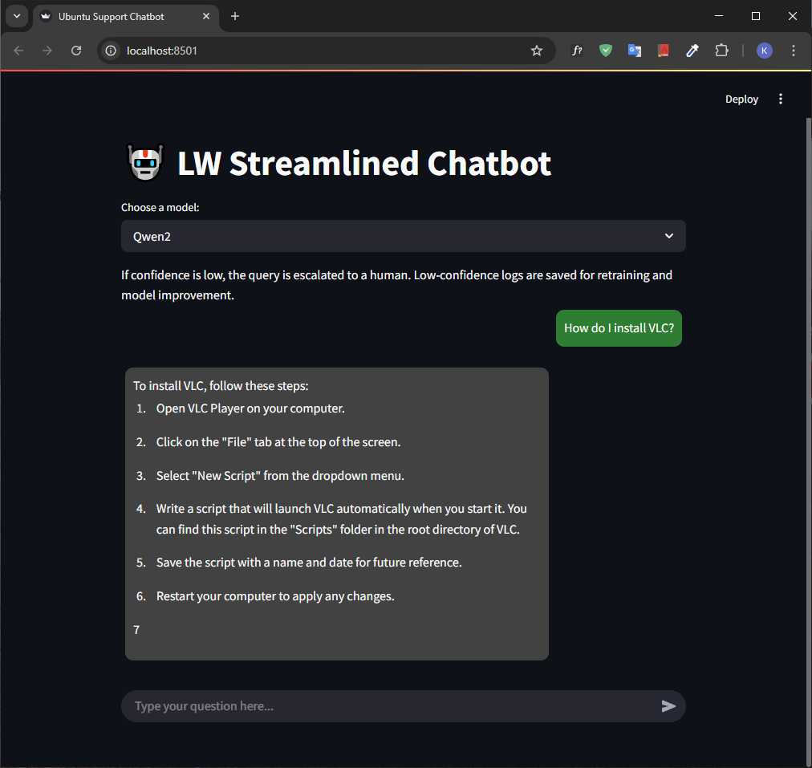
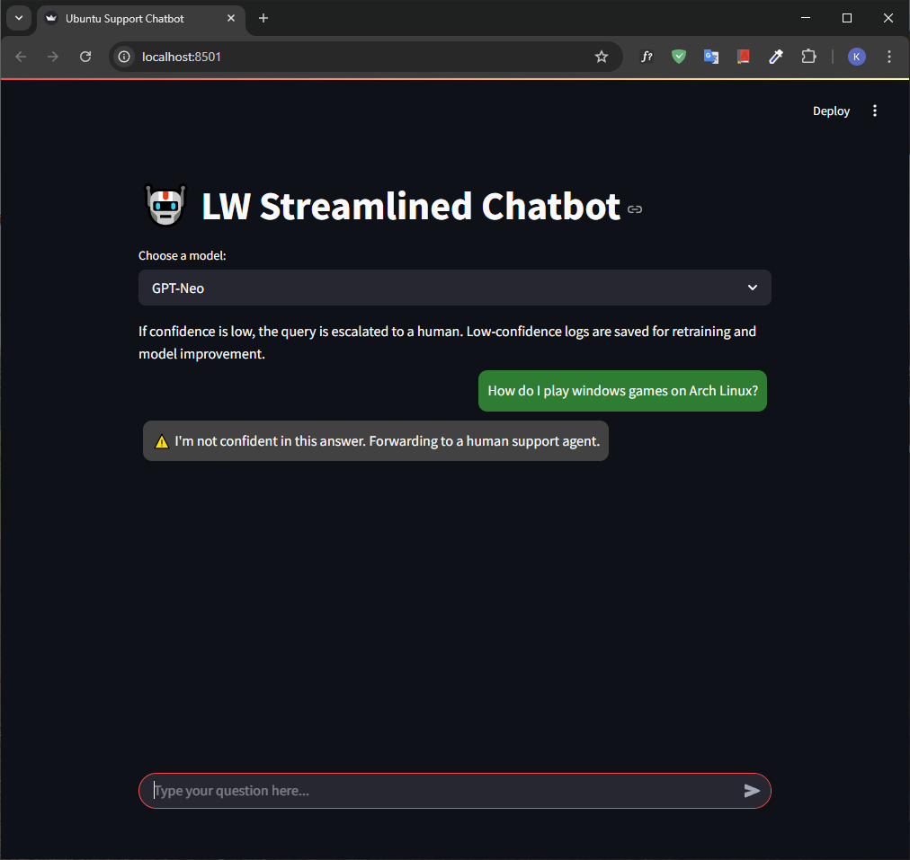
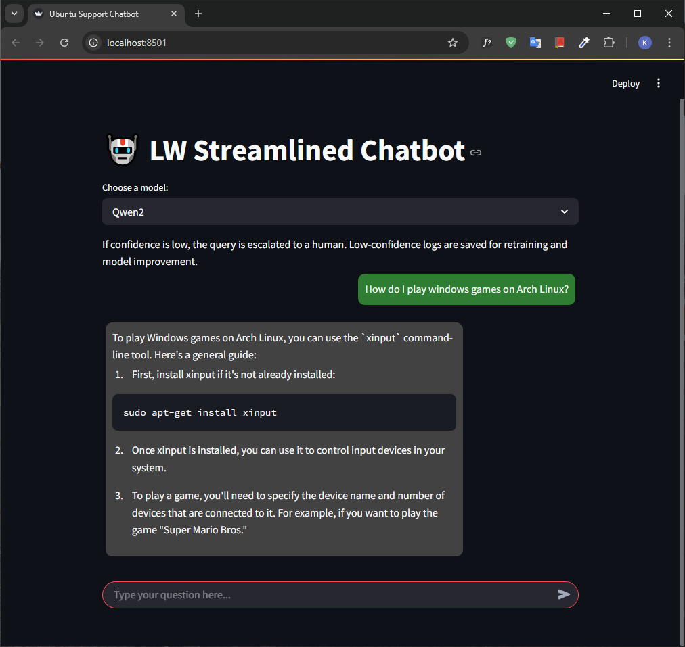

# Lightweight streamlined Chatbot for IT Helpdesk Support

This group project for the AT82.05 Natural Language Understanding course is presented as a project proposal under the guidance of Dr. Chaklam Silpasuwanchai.

The final project is a lightweight instruction-following chatbot trained on the Ubuntu Dialogue Corpus using LoRA-distilled LLMs like Qwen2 and GPT-Neo. Features confidence-based fallback, continuous feedback logging, and a modern chat UI built with Streamlit. The features include:

- 🔁 Knowledge Distillation: Mistral-7B-Instruct distilled into GPT-Neo or Qwen2
- 🧠 LoRA Fine-Tuning: Efficient training on 2080 Ti GPUs using PEFT
- 🔍 Confidence Gating: Low-confidence responses escalate to human support
- 🔄 Feedback Loop: Logs weak model responses for future retraining
- 💬 Streamlit Chat UI: Markdown rendering + chat bubbles + model switcher
- 📦 Multi-model ready: Easily plug in any HuggingFace causal LM with LoRA weights

## Group Name: archx64

## Group Description

**_I'll know it when I see it_**

## Team Members

- Kaung Sithu (<st124974@ait.asia>)
- Maung Maung Kyi Tha (<st125214@ait.asia>)
- Rida Fatma (<st125481@ait.asia>)

## Table of Contents

- [Branches](#branches)
- [Progress Report](#what-did-we-do-in-progress-report)
- [Dataset](#dataset)
- [Training Pipeline Overview](#training-pipeline-overview)
- [Training Results](#training-results)
- [Web Application](#web-application)
- [How to run and some examples for testing](#how-to-run-and-some-examples-for-testing)
- [Future Work](#future-work)
- [Contribution](#contribution)

## Branches

This repository currently have 3 branches.

1. `main`: master branch of the repository.
2. `models`: this is mainly for the models and jupyter notebooks

### What did we do in progress report?

[Click here](progress_report/README.md) to check what we have done in progress report.

## Dataset

Ubuntu Dialog corpus will be used to train and evaluate our model. It contains roughly 1 million two-person conversations that provide real-world technical trouble shooting interactions. The conversations have an average of 8 turns each, with a minimum of 3 turns. All conversations are carried out in text form. The dataset can be accessed from these links.

1. <https://www.kaggle.com/datasets/rtatman/ubuntu-dialogue-corpus>
2. <https://dataset.cs.mcgill.ca/ubuntu-corpus-1.0/>

## Training Pipeline Overview

1. Distillation
    - The training pipeline begins with a distillation phase, where the powerful `mistralai/Mistral-7B-Instruct-v0.3` model serves as the teacher to generate high-quality assistant responses based on prompts derived from the Ubuntu Dialogue Corpus. These responses are produced in batches of 1,000 and after 30 such runs, a total of 30,000 rows are merged and cleaned into a unified dataset `notebooks/sample/merged_distilled_dataset.csv` for downstream training.
2. LoRA Fine-Tuning
    - Next, the student models, either `Qwen2-0.5B-Instruct` or `GPT-Neo-1.3B`, are fine-tuned using the Parameter-Efficient Fine-Tuning (PEFT) framework with 4-bit quantization, significantly reducing GPU memory requirements. The training employs LoRA (Low-Rank Adaptation), which enables fast, lightweight adaptation of large language models on modest hardware such as the RTX 2080 Ti.
3. Evaluation
    - Finally, the pipeline includes an evaluation phase where the model's performance is tracked using key metrics such as evaluation loss and perplexity, measured on both validation and held-out test sets. This feedback supports iterative tuning and validates the effectiveness of the distillation and fine-tuning process.

## Training Results

- This is the result of training `EleutherAI/gpt-neo-1.3B`. 

- Test results of GPT-Neo:

    ```json
    {
        "eval_loss": 1.2192639112472534,
        "eval_runtime": 110.3351,
        "eval_samples_per_second": 40.785,
        "eval_steps_per_second": 10.196,
        "epoch": 2.9935238095238095
    }
    ```

- This is the result of training `Qwen/Qwen2-0.5B-Instruct`. 

- Test results of Qwen2:

    ```json
    {
        "eval_loss": 1.2740108966827393,
        "eval_runtime": 82.3415,
        "eval_samples_per_second": 54.65,
        "eval_steps_per_second": 13.663,
        "epoch": 2.9935238095238095
    }
    ```

## Web Application

The project includes a fully interactive Streamlit web app in `app/app.py` that enables users to chat with the fine-tuned model in a clean, conversational interface.

Key features include:

- 💬 Chat Interface includes markdown rendering and floating chat bubbles
- 🔁 Model Selector to choose between GPT-Neo and Qwen2 student models
- 🧠 Confidence Scoring: Automatically estimates response reliability using token-level softmax probabilities
- 🚨 Human Escalation: If confidence is below a defined threshold, the system responds with a fallback message and logs the query for review
- 📋 Retraining Feedback Loop: Low-confidence user inputs are saved to logs/low_confidence_log.csv, which can be later used for incremental retraining

### How to run and some examples for testing

Navigate to the `app` directory and execute the command.

```bash
streamlit run app.py
```

When you launch the application. This is the homepage you see.   

Users can select the model that they would like to use.   

GPT-Neo does not hallucinate and give relevant responses.   

Although confidence is high, Qwen2 hallucinates. 

Since the confidence is low, it is saved to the log file and the conversation will be handed to human tech support. 

We expected the responses the response to be low confidence or something related with Wine. However, it responded something different and it's somehow a little bit relevant. 

## Future Work

- 📝 Human review (optional): Add interface or file for humans to manullay verify/edit responses
- 🔁 Dataset curation: Filter & clean logs into format usable for finetuning.
- 📦 Retraining pipeline: Feed curated logs into your LoRA distillation script. It was not possible to implement due to insufficient computational resources.
🔄 Periodic retrain & reload. Automate model update and reload in the app. Unavailable due to the same reason as above and available time before submission.

## Contribution

Contributions are welcome! Feel free to open issues, suggest features, or submit pull requests.
